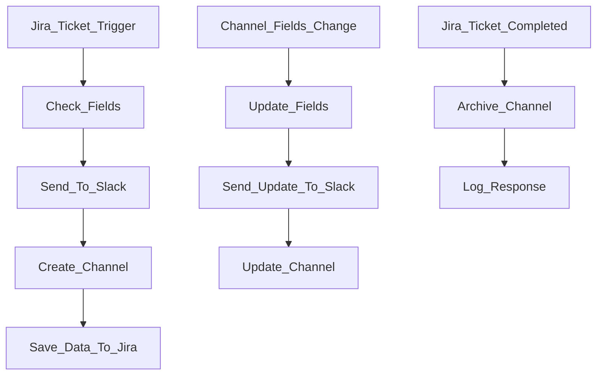

## Introduction
For this Jira and Slack app integration, consider a scenario in which your organization performs regular deployments of microservices, and each development team uses a different Jira project. Each deployment must have a dedicated Slack channel associated with it that references a deployment Jira ticket, as well as key details of the ticket and deployment. This automation streamlines the process of creating each Slack channel, populating details about the ticket, and even automatically updating the channel if the ticket changes.

## Prerequisites
Prior to following this guide, please ensure you have:
- Jira admin or another level of permissions sufficient to create multi-project Automation rules.
- A **Slack account** with permissions to create a Slack app.
- A working knowledge of [Jira Automation](https://support.atlassian.com/cloud-automation/docs/jira-cloud-automation/) and familiarity with the [Slack Web API](https://docs.slack.dev/apis/web-api/).

## Solution Overview
To implement this solution, you'll need to:
1. Create a Slack app to receive data from Jira.
2. Set up at least three Jira Automation rules:
   - Create a Slack channel when a Jira ticket is updated with specific data.
   - Update the Slack channel when details in the Jira ticket change.
   - Archive the Slack channel when the Jira ticket is marked as complete.

### Jira Automation Rules
#### Rule 1: Slack Channel Creation
- **Trigger**: When a custom field in Jira is set.
- **Actions**:
  - Check if required fields (e.g., summary, priority, client) are filled.
  - If fields are incomplete, revert the trigger and notify the user.
  - Once fields are filled, send a web request to the Slack Web API to create a new channel with details from the Jira ticket.
  - Save the Slack channel ID and timestamp back into the Jira ticket.

#### Rule 2: Slack Channel Updates
- **Trigger**: When fields in the Jira ticket (e.g., summary, due date) are updated.
- **Actions**:
  - Verify if a Slack channel ID exists in the Jira ticket.
  - Send updated details to the Slack Web API to update the channel’s name and information.
  - Save the updated timestamp in the Jira ticket.

#### Rule 3: Slack Channel Archive
- **Trigger**: When a Jira ticket status moves to "Done" or on a predefined schedule.
- **Actions**:
  - Retrieve the Slack channel ID from the Jira ticket.
  - Send a request to the Slack Web API to archive the channel.
  - Log the Slack response for future reference.

## Channel Creation Flow Diagram

## Steps

### Step 1: Create the Slack app
1. Go to the [Slack Web API](https://api.slack.com/apps) dashboard and click "Create New App."
2. Follow the instructions to create a new app and give it the necessary permissions to handle incoming requests from Jira.
3. Under the "OAuth & Permissions" section, configure the following permissions:
   - `channels:manage` - To create, update, and archive channels.
   - `chat:write` - To post messages to the channel.
   - `channels:read` - To read channel information.
4. Generate OAuth tokens that will be used in your Jira Automation rules.

### Step 2: Create Jira Automation Rules
1. In your Jira project, navigate to **Project settings** > **Automation**.
2. Click **Create Rule**, then configure **Rule 1- Slack Channel Creation**:
   - Set the trigger as a field update (e.g., a custom field like "Create Slack Channel").
   - Add a condition to check if required fields (e.g., summary, priority) are filled.
   - Set up an action to send a request to the Slack Web API to create the channel. 
    
   **Note:** Slack requires channel names to be lowercase. Use `.toLowerCase()` in the request body. 
   **Note:** Select the **Hidden** checkbox for the Slack authorization header to avoid exposing your token.
   - Store the Slack channel ID and timestamp in Jira. For example, as a string in a custom field.
3. Click **Turn on rule**.
   
4. Click **Create Rule** again, then configure **Rule 2- Slack Channel Updates**:
   - Trigger the rule when certain fields (e.g., summary, priority) are updated.
   - Send a POST request to the Slack Web API with the new information.
5. Click **Turn on rule**.

6. Click **Create Rule** again, then configure **Rule 3- Slack Channel Archive**:
   - Trigger the rule when the Jira ticket is marked as "Done" or on a scheduled basis.
   - Send a final POST web request to Slack to archive the channel.
7. Click **Turn on rule**.

### Step 3: Customize and Test the Rules
1. If you have specific requirements (e.g., prevent auto-creation when cloning tickets or push updates to write-protected fields), you can add additional rules or conditions.
2. Test your automation by creating a test Jira ticket and ensuring the correct Slack channels are created, updated, and archived as expected.
