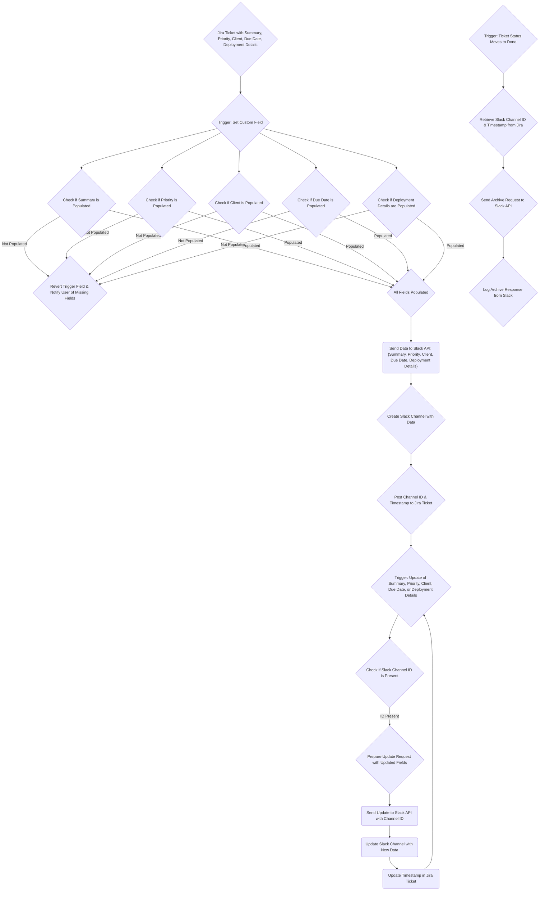

Using this integration you can create a Slack App and a series of Automation rules in Jira to automatically create and populate Slack channels with data directly for Jira tickets. Slack Channel names and key details are also automatically updated if they change in Jira, and are automatically archived based on attributes like ticket status or schedules.

### Example
For example, your organization performs regular productiondeployments of microservices, and the development teams that support those services each use different Jira projects, and deployments can take place at any time.

This automaiton allows engineers, product teams, and external teams to effortlessly create, update, and archive Slack Channels for any communications that need to take place related to those deployments.  

This is especially helpful in environments where deployments occur frequently, and may require coordination for things like testing or downtime in client-specific environments. 

### Overview

Implementing this solution requires creating a Slack App to receive data from Jira. Additionally, you will need to create a minimum of three Automation rules. 

At a high level, the automation works as follows: 

#### Jira Rules
**Rule 1: Auto-Create Slack Channel** - When this rule is triggered by setting a specific value within a custom field in Jira, this rule runs a series of checks to ensure that **Summary**, **Priority**, **Client**, **Due Date** and **Deployment Details** fields are populated. If they are not, the rule automatically reverts the trigger field, and @ mentions the user in a message within the ticket, listing out which fields must be populated in order to create the channel. 

Once the user has populated those fields, they can set the trigger field again, which retrieves the data from the required fields in the Jira ticket, and sends them in a web request step to the Slack API to create the slack channel, and populate the name with key details from the Jira ticket. It also adds a message in the channel, and sends the Channel ID and channel creation Timestamp back to Jira to be written in a read-only field within the associated Jira ticket.

**Rule 2: Auto-Update Slack Channel** - This rule is triggered when any of the **Summary**, **Priority**, **Client**, **Due Date** and **Deployment Details** fields are updated for any ticket in the group of Jira Projects assocaited with this rule. The rule checks if the **Slack Channel ID** field is popualted with a Channel ID and Timestamp. If it is, then the rule sets the values of the aforementioned fields as variables, and compiles them into a web request. That web request is then sent to the Slack Channel Updates endpoint with the associated Channel ID and Timestamp to identify the appropriate channel. The key details in the channel are successfully updated. 

The rule then retrieves the updated timestamp in the web response received from Slack and overwrites the existing timestamp in the read-only field within the ticket. This maintains the link between the Jira ticket and the Slack Channel for subsequent updates.

**Rule 3: Archive Channel** - This rule can be triggered on a schedule, or can be triggered when the Status of any ticket within the associated projects moves to a Done (complete, canceled, done, etc) state.

When triggered, this rule simply retrieves the Channel ID and Timestamp from the associated ticket, and sends it in a web request to the Slack API Channel Archive endpoint to archive the channel. It then logs the response from Slack in case it is needed for future reference.

The following diagram provides an overview of the workflow: 

## Prerequisites
You need at least the following permissions to implement this solution: 
- Jira Administrator role - This is required for creating Jira Automation rules with a multi-project scope, custom fields in Jira, and also to generate security keys to access the Jira Applicaiton Programming Interface (API).
- A Slack user account - A standard Slack user account in your organization's workspace is required so that to access Slack App creation tools.

Prior knowledge of [Jira Automation rules](https://support.atlassian.com/cloud-automation/docs/jira-cloud-automation/), [Smart Values](https://support.atlassian.com/cloud-automation/docs/smart-values-in-jira-automation/), [Regular Expressions](https://www.regular-expressions.info/), and basic [REST API](https://aws.amazon.com/what-is/api/#:~:text=APIs%20are%20mechanisms%20that%20enable,weather%20updates%20on%20your%20phone.) usage is strongly recommended.

 


More content about each of sections below is forthcoming.


## Create the Slack App

## Create the Jira Automation Rules

### Rule 1: Slack Channel Creation

### Rule 2: Slack Channel Updates

### Rule 3: Slack Channel Archive

### Other Recommended Rules

#### Prevent Auto-Creation on Clone

#### Push updates to write-protected fields